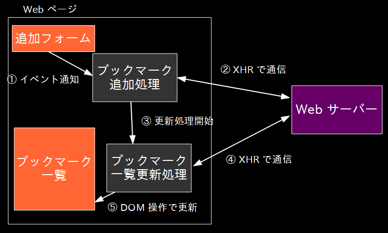

フロントエンドにおけるアプリケーション設計
================================================================

## 例: ブックマーク一覧

* ブックマーク追加フォームとブックマーク一覧があるページ
  * ブックマークを追加/編集したら、ページ遷移せずにブックマーク一覧を更新したい

### 陥りがちな問題

初心者が素朴に書くとこうなりがち。

この設計にはいくつか問題がある。

* ブックマーク操作や表示の種類が増えると、組合せが膨大に
  * 操作: ブックマーク作成、更新、削除、……
  * 表示: 全部ブックマーク一覧、最近更新されたブックマーク、ゴミ箱、……
* 通信処理が分散している
  * コードが重複したり
  * 同じ内容の通信を何度もしてしまったり

### ModelとViewの分離がカギ

* Model
  * ビジネスロジック
  * サーバーとの通信、ブックマーク一覧データの管理
* View
  * 見た目の処理
  * DOM操作 (ブックマーク一覧更新)
