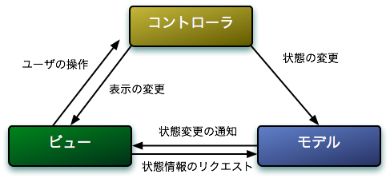

MVC
================================================================

## 概要

* 処理をModel, View, Controllerに分類
  * Model: ビジネスロジック全部
  * View: 見た目の処理
  * Controller: ユーザーの操作に応じてModelを呼び、更新する
* 元々はGUIプログラミングで発明された概念 [1](#foot-1)
* サーバーサイドのWAFでよく使われるアーキテクチャ [2](#foot-2)
  * Ruby on Rails, CakePHPなど
  * クライアントサイドではAjaxが絡んだりして、より複雑

* 代表的なフレームワーク
  * Backbone.js
  * Mithril

## ブックマーク一覧をMVCで

1. http://heim.ifi.uio.no/~trygver/themes/mvc/mvc-index.html <a name="foot-1">^</a>
2. サーバーサイドでのMVCとは本来のMVCとは異なり、 MVC2などと呼ばれる <a name="foot-2">^</a>
