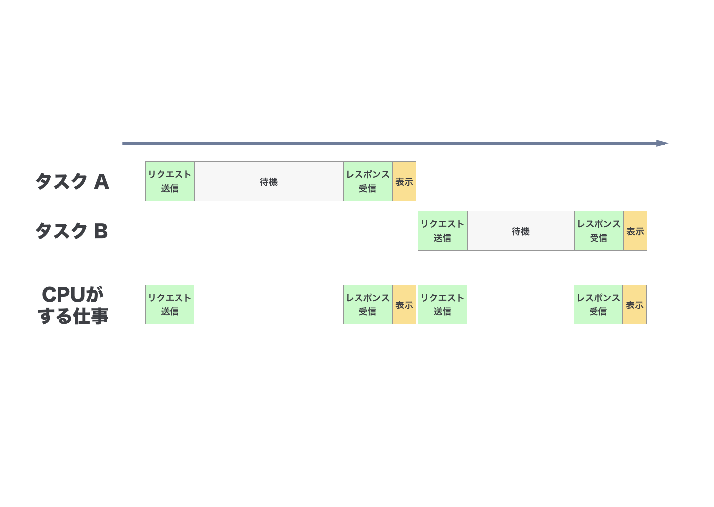
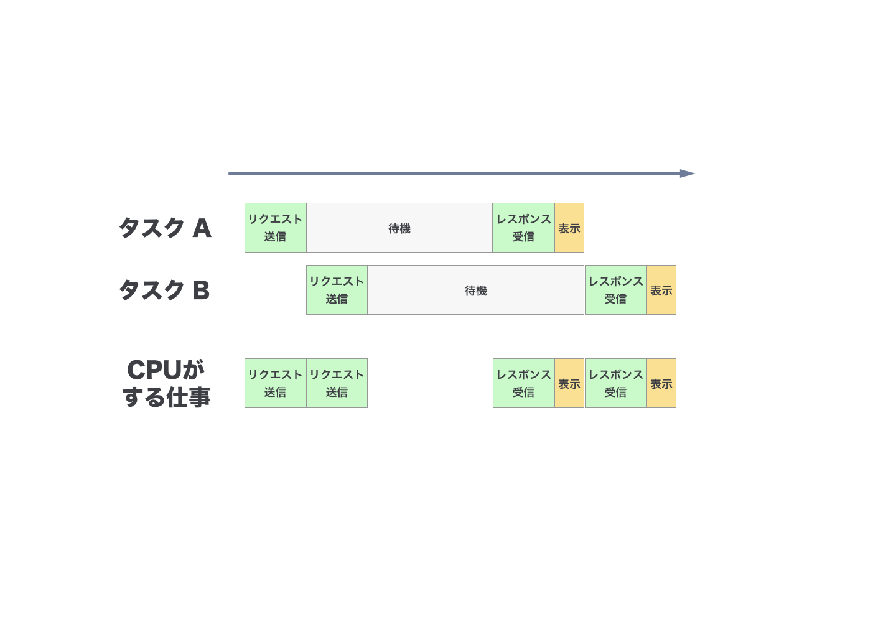

# 非同期プログラミング

## JSでの並列処理

* JSはシングルスレッド
  * スレッドやプロセスなどの機構がない <sup>[1](#foot-1)</sup> <sup>[2](#foot-2)</sup>
  * 同時に2つのコードが実行されないのでロックとか不要  
  * 1つの処理が実行中だと、他の処理は _全て止まる_
    ```javascript
    while (true) alert(1);
    ```

## 非同期プログラミング

複数のことを同時に処理するため **非同期プログラミング** を行う。

同期的に処理するとムダで遅い仕事も


非同期に処理すると効率よくて速い



## JSでの非同期プログラミング方法

* コールバック関数
* イベント
* Promise
* その他 (Generator, Async Functions, Stream, etc...)


1. 最近は [Web Worker](https://developer.mozilla.org/ja/docs/Web/API/Web_Workers_API/Using_web_workers) がある <sup><a name="foot-1">^</a></sup>
2. Node.jsではマルチプロセスプログラミングが可能 <sup><a name="foot-2">^</a></sup>
