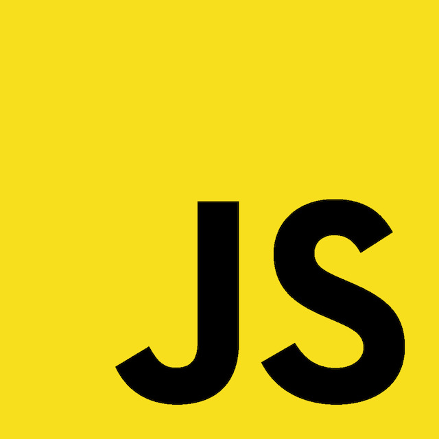

JavaScript言語について
================================================================

## 言語的特徴

* 動的型付け
* 関数も値の一種
* C-likeな文法
* プロトタイプベースの継承構造
  * 近年Class構文が追加された
* 言語のコア部分はECMAScriptとして標準化されている
  * [JavaScript と ECMAScript 仕様について (JavaScript Overview - MDN)](https://developer.mozilla.org/ja/docs/Web/JavaScript/Guide/Introduction#JavaScript_and_the_ECMAScript_Specification)
  * ECMAScript最新仕様は [ECMAScript® 2016 Language Specification](http://www.ecma-international.org/ecma-262/7.0/)

以下では、ECMAScript2016をベースに、JavaScriptという言語自体について解説します。
