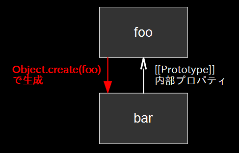
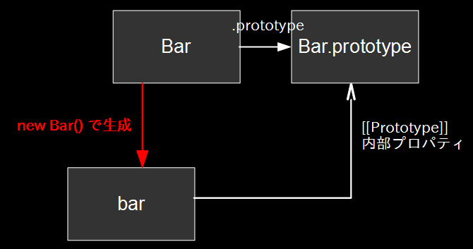

クラス
================================================================

## プロトタイプ継承

* オブジェクトそのものが別のオブジェクトを継承できる
* プロパティにアクセスされた時、指定のプロパティを持っていない場合は継承先を探索
  * 継承先がなくなるまで続く

```javascript
var foo = {
    name: "foo"
};
// `foo` を継承した `bar` を生成
var bar = Object.create(foo);
bar.name; // "foo"

bar.name = "bar";
bar.name; // "bar"
foo.name; // "foo"
```




## プロトタイプチェイン



* 暗黙的参照は既定オブジェクトである `Object` まで暗黙的な参照を持っている
  * あえて壊すことはできる

```javascript
Object.getPrototypeOf({});                // Object.prototype
Object.getPrototypeOf(Object.prototype);  // null
Object.getPrototypeOf(null);              // TypeError
```


## JavaScriptにおけるクラス

JavaScriptのクラスの正体は関数。

* 関数を `new` を付けて呼び出すと、コンストラクタとして作用する
  * 新しいオブジェクトを生成する
  * 生成したオブジェクトを `this` に束縛してコンストラクタの中身を実装する
  * 生成されたオブジェクトは、コンストラクタの `prototype` をプロトタイプ継承している

```javascript
// Foo コンストラクタ
var Foo = function () {
    // プロパティ定義    
    // この `this` は、新しく生成されたオブジェクトを指す
    this.price = 100;  

    // これはコンストラクタ終了後破棄される
    var price = 100;  
};

// メソッド定義
Foo.prototype.sayHello = function () {
    alert('hello!');
};
Foo.prototype.getPrice = function () {
    return this.price;
};

// `foo` は `Foo` コンストラクタのインスタンス (`Foo` オブジェクト)
var foo = new Foo();
foo.sayHello(); //=> 'hello!'
var price = foo.getPrice();
console.log(price); //=> 100
```


## クラスの継承

- クラスの継承にもプロトタイプ継承を利用できる
  - 親のコンストラクタのプロトタイプを継承すればよい

```javascript
var SuperClass = function (name) {
    this.name = name;
};
SuperClass.prototype.foo = function () { return 'Super : foo'; };
SuperClass.prototype.bar = function () { return 'Super : bar'; };

var SubClass = function (name) {
    SuperClass.call(this, name);  // 親クラスのコンストラクタを呼び出す
};

// prototypeを継承
SubClass.prototype = Object.create(SuperClass.prototype);

// 子クラスのメソッドを定義
SubClass.prototype.foo = function () { return 'Sub : Foo'; };

var sub = new SubClass('sub1');
```


## `Class` 構文

- ES2015で `Class` 構文が導入された
  - これまでのコンストラクタのシンタックスシュガー

これが。
```javascript
var Foo = function (name) {
    this.name = name;
};
Foo.prototype.sayHello = function () {
    alert('hello!');
};
```

こうかける。
```javascript
class Foo {
    constructor (name) {
        this.name = name;
    }

    sayHello () {
        alert('hello!');
    }
}
```

- 継承も簡単
  - `super()` で親クラスのコンストラクタを呼び出す
  - `super.foo` で親クラスのメソッドを呼び出し

```javascript
class Foo {
    constructor (name)  {
        this.name = name;
    }

    sayFoo () {
        console.log(`Foo I'm ${this.name}`);
    }
}

class Bar extends Foo {
    constructor (name) {
        super(name);
    }

    sayFooBar () {
        super.sayFoo();
        console.log('BarBarBar');
    }
}

new Bar('bar').sayFooBar();
// Foo I'm bar
// BarBarBar
```

- 使える環境ではガンガン使っていこう
  - 課題でも使ってOK
